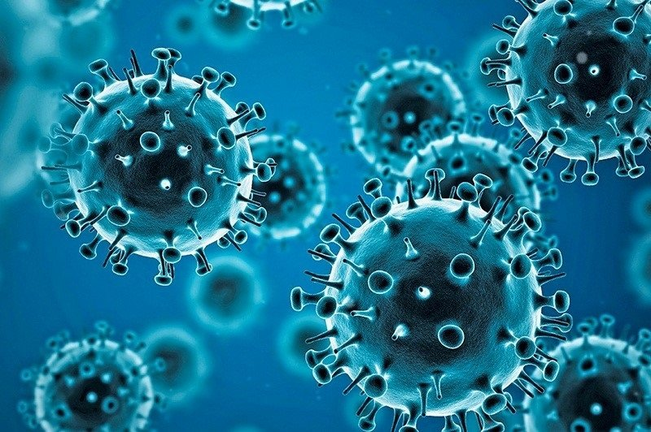

#                                                   Project Proposal

## Project Title: Covid-19 Analysis of Australia

### Team Members: 
    Frank McKenzie-Stripp 
    Halley Ngoc Pham
    Carl Gonzales
    Yan Shao

### Project Description/Outline:
    The aim of our project is to explore and uncover patterns in COVID-19 case data within
    Australia. We’ll examine relationships between case numbers over time, between different
    states, and compared to vaccination and hospitalisation rates.

    This will involve retrieving current and historical COVID-19 case data from websites that
    report it, listed below under data sources. This data will be stored in an SQL database,
    cleaned and organised as necessary, then visualised. The nature of COVID-19 reporting
    means that the visualisations produced will be live, meaning that they will be updated
    automatically.

### Data Sources:
    https://covidlive.com.au

### GitHub Repository:
    https://github.com/FrankMS3/Project-3

### Final Design Sketch:
##### Home Page -
    When the user hovers over a state on the
    map, summary stats will be displayed.
    Clicking on a state will take the user to
    that state’s own individual page.

##### State Page -
    Each state will have their own individual
    webpage. This page will show
    visualisations specific to the selected state.
    One will be a graph showing changes over
    time, the particular data shown on this
    graph will be toggleable by the user,
    options will include: covid case numbers,
    vaccinations, hospitalisations, and deaths.
    Notable events will be marked along this
    graph. Another visualisation shown on this
    page will visualise summary statistics.

##### Comparisons Page -
    This page is used to create a comparison
    bar chart between all states/territories in term
    of hospitalisation, deaths, covid case number,
    ventilisation...

### Technologies Used:
        
    Jupyter Notebook
    Pandas
    Postgres SQL
    SQL Alchemy
    Flask API
    Render Template
    HTML5
    CSS
    D3 
    JavaScript
    JavaScript InfoVis toolkit
    Chart.js