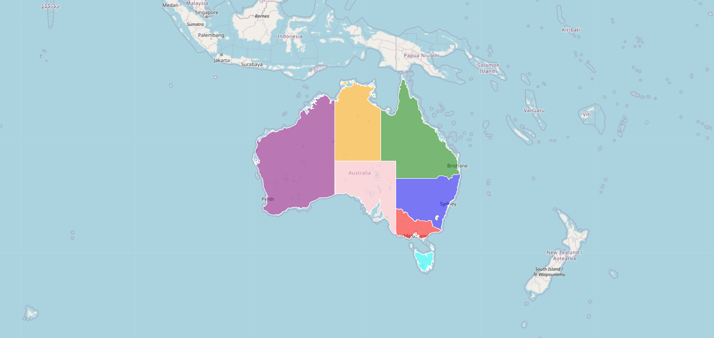
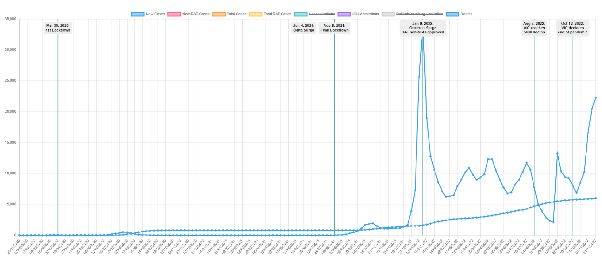

# Project-3-COVID19-Data-Visualisation

Please refer to the Project Proposal File for more information about the project details.

1. To run the program, create a config.py file. In there, store your password to run the Postgres.

2. Next, make sure your Pandas version is at least 1.5 or newer, setup the Postgres with the database, running the covid.sql to create all the schema ready. Then running the main.ipynb file to start scraping the data as well as the cleaning process.

3. Thirdly, running the app.py. This is the Flask to run the API as well as generating all the web pages with the main page (index.html)

# Project-3-Australian Covid-19 Data Visualisation & Comparison

**_Table of Contents:_**

1. [Purpose of the assignment](#purpose-of-the-assignment)
1. [Data Sources:](#data-sources:)
1. [Process of the project](#process-of-the-project)
1. [Visualisation & comparison](#visualisatio-&-comparison)

 

### Purpose of the assignment

    The aim of our project is to explore and uncover patterns in COVID-19 case data within
    Australia. We’ll examine relationships between case numbers over time, between different
    states, and compared to vaccination and hospitalisation rates.

    This will involve retrieving current and historical COVID-19 case data from websites that
    report it, listed below under data sources. This data will be stored in an SQL database,
    cleaned and organised as necessary, then visualised. The nature of COVID-19 reporting
    means that the visualisations produced will be live, meaning that they will be updated
    automatically.

 

### Data sources:

    -https://covidlive.com.au
    -https://www.health.gov.au/health-alerts/covid-19/case-numbers-and-statistics
    -https://nationalmap.gov.au/

 

### Process of the project

1. main.ipynb we scrape the websites and retrieve the database then we clean the dataset
1. covid.sql which was kept in the Resources where we created 8 tables in PostgreSQL
1. app.py is the python file where we create all the routes and retrieved the data to json format.
1. js Libaries and CSS

- Leaflet and D3js : we created the homepage australia map
- Chart js and it's annotation plugin: we imported the libary which we haven't learnt before to desgin the line charts and the bar charts.
   

### Visualisation & comparison

1. Here is our homepage:
   On the navbar by clicking the **state** button, you can link each state's page and by clicking the **comparison** button
   Our home page contains a map of Australia which colourfully differentiates each state we cover for this project.
   A small cool function we added is the mouseover function which enables us to see the name of the state as we hover over them.
   
    
1. Here are our states page:
   For each of our states, we have created a page which displays a line graph using chart.js that shows a timeline of the different datasets we used.
   The labels shown at the top of the page can be toggled on and off according to the user’s preference. We used a hidden function to hide certain labels when entering our state pages to avoid overcrowding of lines and to only show the most important and useful labels first.
   Our data spans over a time period from Jan 2020 to the current date which will continue to update as new information comes through from the COVIDLIVE website.
   You may have also noticed some vertical green lines on our graph. We used a plugin to add annotation to our graph that identify key events over the time period for each state. 
   Another small feature to note is that you can hover over all the data points to get more info regarding the label and the chosen date. 
   
   
    

1. Here is our comparison page :
   We have create a bar chart again using chart.js to display the datasets that we used but comparing them amongst all the states. 
   At the top of our page, we have added a drop down menu which lists all our labels previously used in our state pages. The user will be able to click on whatever dataset they are interested in to see how each state compares to one another. 
   Finally, we can hover over each state’s bar to get the actual numbers of the chosen dataset.
   
